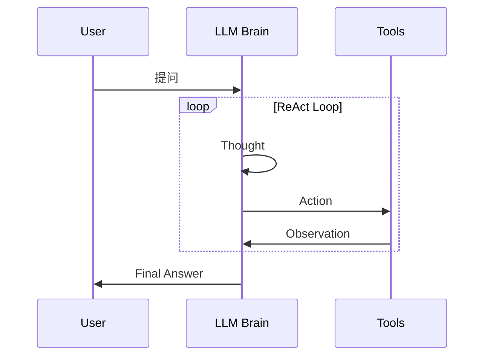
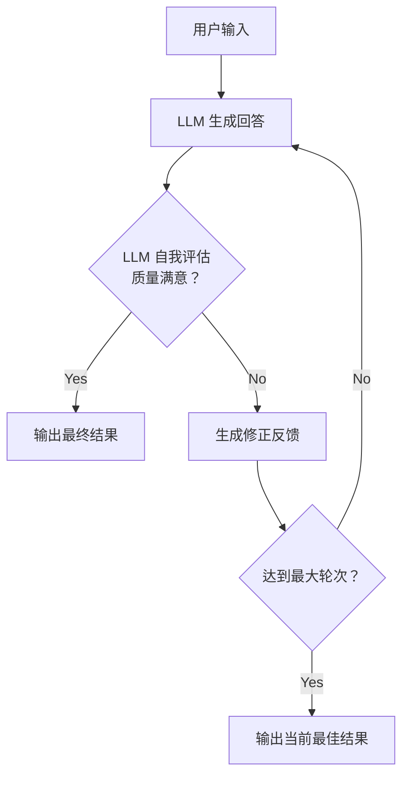
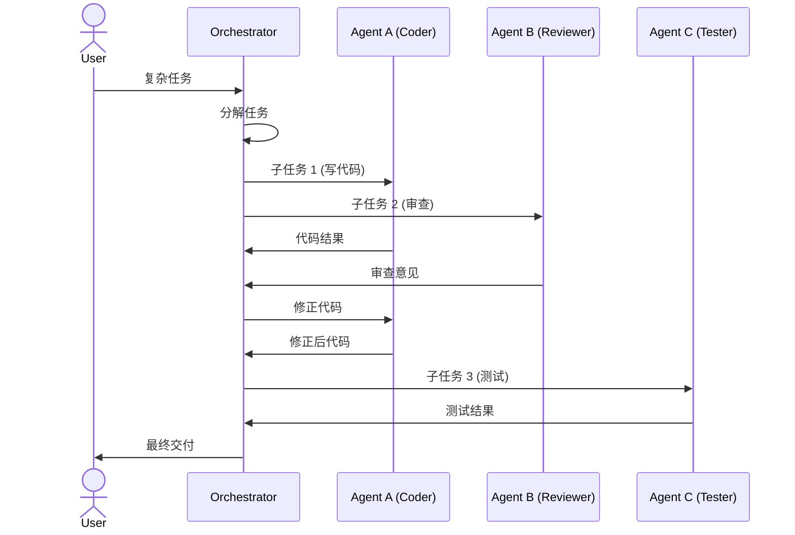
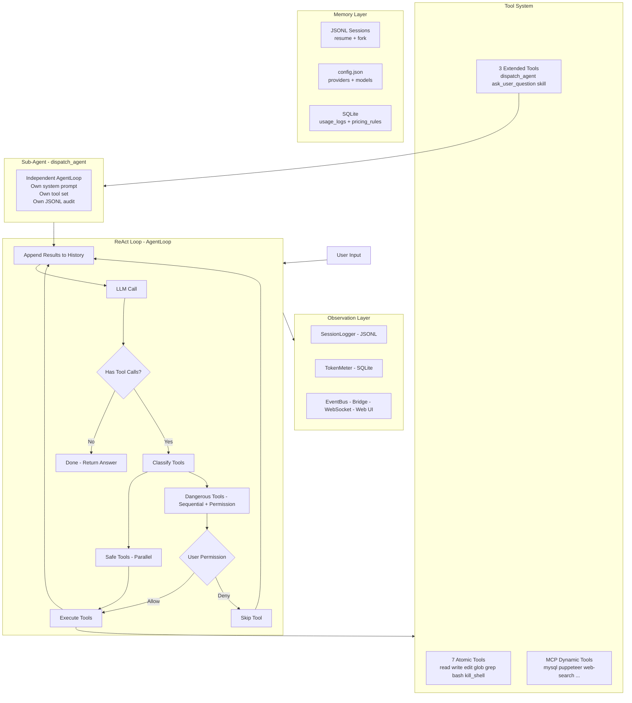
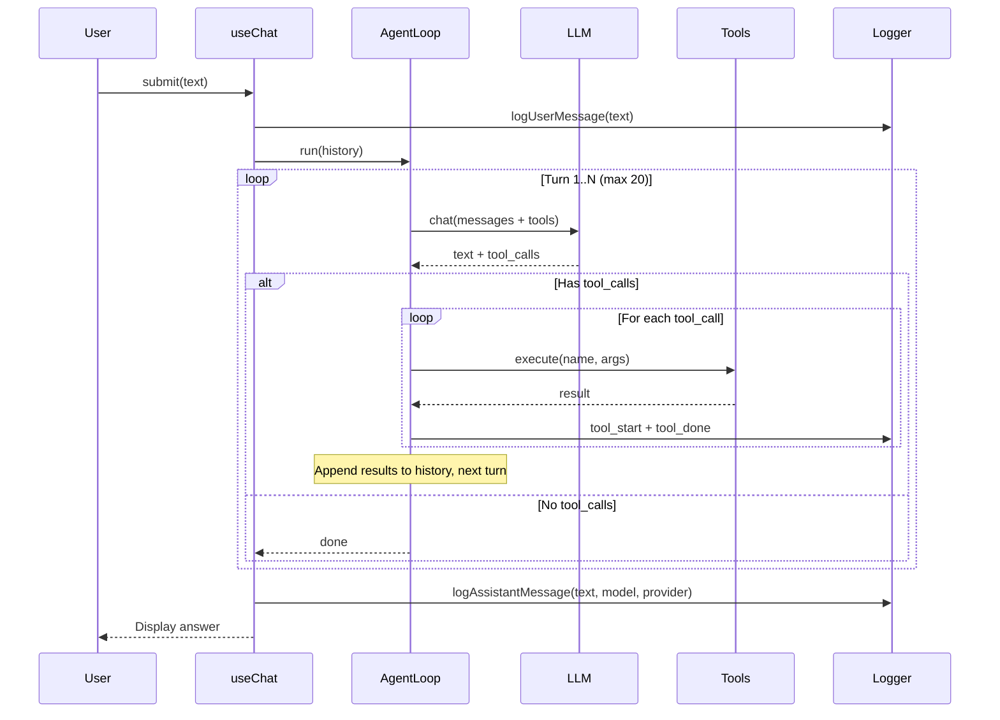
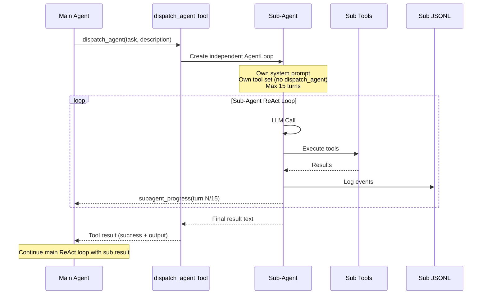

# Agent 工程架构模式全景

> 日期: 2026-03-17
> 用途: 理解 AI Agent 的主流架构模式，为 ZCli 的架构演进提供理论基础
> 参考: 综合 arxiv 论文、Google Cloud 架构指南、Microsoft Azure 实践

---

## 一、什么是 Agent

一句话：**Agent = LLM + 记忆 + 工具 + 规划**。

传统的 LLM 调用是"一问一答"——你给一个 prompt，它返回一段文本，结束。Agent 在此基础上加了一个**循环**：LLM 不只生成文本，还能**思考要做什么**（规划）、**调用外部工具**（行动）、**观察结果**（感知）、**决定下一步**（推理），如此循环直到任务完成。

```
传统 LLM:
  用户 → LLM → 回答 → 结束

Agent:
  用户 → LLM → 思考 → 调用工具 → 观察结果 → 继续思考 → 调用工具 → ... → 最终回答
```

这个"思考→行动→观察"的循环就是 Agent 架构的核心。不同的架构模式本质上是在回答一个问题：**这个循环怎么组织？**

---

## 二、六大基础能力

在讨论架构模式之前，先理解 Agent 的六大基础能力。任何架构都是这些能力的不同组合方式。

```
┌─────────────────────────────────────────────┐
│                  Agent                       │
│                                              │
│  ┌──────────┐  ┌──────────┐  ┌──────────┐  │
│  │  感知     │  │  推理     │  │  规划     │  │
│  │Perception│  │Reasoning │  │Planning  │  │
│  └──────────┘  └──────────┘  └──────────┘  │
│                                              │
│  ┌──────────┐  ┌──────────┐  ┌──────────┐  │
│  │  行动     │  │  记忆     │  │  协作     │  │
│  │  Action   │  │  Memory  │  │Collab    │  │
│  └──────────┘  └──────────┘  └──────────┘  │
│                                              │
└─────────────────────────────────────────────┘
```

| 能力 | 说明 | 典型实现 |
|------|------|---------|
| **感知 Perception** | 理解输入（文本、图像、代码、工具输出） | Prompt 解析、多模态输入 |
| **推理 Reasoning** | 分析问题、做出判断 | Chain of Thought、Self-Reflection |
| **规划 Planning** | 分解任务、确定步骤顺序 | Task Decomposition、Tree of Thought |
| **行动 Action** | 执行操作、调用工具 | Function Calling、Code Execution |
| **记忆 Memory** | 保持上下文、记住过去 | 对话历史、向量数据库、JSONL |
| **协作 Collaboration** | 多个 Agent 分工合作 | 子 Agent 派发、消息传递 |

---

## 三、七大架构模式

### 3.1 简单 LLM 调用（Prompt → Response）

最基础的形式，不算真正的 Agent，但是所有架构的起点。

```
┌──────┐     ┌──────┐     ┌──────┐
│ User │────→│  LLM │────→│Output│
└──────┘     └──────┘     └──────┘
```

**特点**：一问一答，无循环，无工具调用。
**适用**：简单问答、文本生成、翻译。
**局限**：无法执行动作、无法获取实时信息、容易幻觉。

---

### 3.2 ReAct（推理 + 行动循环）

**最经典的 Agent 架构。** 名字来自 "Reasoning + Acting"。

```
┌──────────────────────────────────────────┐
│              ReAct Loop                   │
│                                           │
│  ┌────────┐   ┌────────┐   ┌──────────┐ │
│  │Thought │──→│ Action │──→│Observation│ │
│  │ 思考    │   │ 行动    │   │ 观察结果  │ │
│  └────────┘   └────────┘   └──────────┘ │
│       ↑                          │        │
│       └──────────────────────────┘        │
│              循环直到完成                   │
└──────────────────────────────────────────┘
```

**执行流程**：

```
用户: "帮我查一下北京今天的天气"

Thought: 用户要查天气，我需要调用天气 API
Action:  call weather_api("北京")
Observation: 晴，25°C，东风 3 级

Thought: 已经拿到天气信息，可以回答了
Answer: 北京今天晴，气温 25°C，东风 3 级。
```

**Mermaid 序列图**：



**论文**：Yao et al., "ReAct: Synergizing Reasoning and Acting in Language Models" (2023)

**优势**：
- 推理过程透明（Thought 可读）
- 幻觉率低（6% vs CoT 的 14%）
- 实现简单，是大多数 Agent 框架的默认模式

**劣势**：
- 串行执行，速度受限于工具调用延迟
- 容易陷入循环（思考→行动→思考→行动...不收敛）
- 单一 LLM 的推理能力是天花板

**ZCli 对应**：`AgentLoop` 的核心就是 ReAct 模式。`#callLLM` → 收集 tool_calls → `#executeToolCalls` → 结果追加到 history → 再次 `#callLLM`。

---

### 3.3 Reflection（自我反思）

Agent 在给出回答后，让 LLM **审视自己的输出**，发现问题后自我修正。

```
┌──────────────────────────────────────────────┐
│             Reflection Pattern                │
│                                               │
│  ┌────────┐   ┌──────────┐   ┌────────────┐ │
│  │Generate│──→│ Evaluate │──→│  Satisfactory│ │
│  │ 生成    │   │ 自我评估  │   │    ？       │ │
│  └────────┘   └──────────┘   └────────────┘ │
│       ↑              │              │ Yes     │
│       │              │ No           ↓         │
│       └──────────────┘         ┌────────┐    │
│          修正重试               │ Output │    │
│                                └────────┘    │
└──────────────────────────────────────────────┘
```

**Mermaid 流程图**：



**论文**：Shinn et al., "Reflexion: Language Agents with Verbal Reinforcement Learning" (2023)

**优势**：
- 输出质量显著提高
- 可以叠加到任何其他模式上（ReAct + Reflection）
- 错误自动修正，减少人工干预

**劣势**：
- Token 消耗翻倍甚至更多
- 评估本身可能出错（LLM 评估 LLM）
- 增加延迟

---

### 3.4 Planning（规划分解）

先把复杂任务**分解为子步骤**，再逐步执行。与 ReAct 的区别：ReAct 是边想边做，Planning 是先想好再做。

```
┌──────────────────────────────────────────────────┐
│               Planning Pattern                    │
│                                                   │
│  ┌──────────┐                                    │
│  │ 用户任务  │                                    │
│  └────┬─────┘                                    │
│       │ 分解                                      │
│       ↓                                           │
│  ┌──────────────────────────────────┐            │
│  │ Plan: [步骤1, 步骤2, 步骤3, ...]  │            │
│  └──────────────────────────────────┘            │
│       │                                           │
│       ↓ 逐步执行                                  │
│  ┌─────────┐  ┌─────────┐  ┌─────────┐          │
│  │ Step 1  │→ │ Step 2  │→ │ Step 3  │→ 完成    │
│  └─────────┘  └─────────┘  └─────────┘          │
└──────────────────────────────────────────────────┘
```

**论文**：
- Wei et al., "Chain-of-Thought Prompting" (2022) — CoT 的核心思想
- Yao et al., "Tree of Thoughts" (2023) — 树形搜索规划
- Hao et al., "Reasoning with Language Model is Planning with World Model" (2023)

**优势**：
- 复杂任务的成功率高
- 执行过程可预测（计划是明确的）
- 方便进度追踪和中断恢复

**劣势**：
- 前期规划耗时
- 计划可能不准（对未知任务估计有偏）
- 执行中遇到异常需要重新规划（RePlan）

---

### 3.5 Tool Use（工具调用）

Agent 通过调用外部工具来获取信息和执行操作。这不是独立的架构模式，而是所有 Agent 架构的**基础设施层**。

```
┌──────────────────────────────────────────────────┐
│                Tool Use Layer                     │
│                                                   │
│  ┌─────┐  ┌────────┐  ┌──────┐  ┌───────────┐  │
│  │Read │  │ Search │  │ Bash │  │ API Call  │  │
│  │File │  │  Grep  │  │Shell │  │ (MCP etc) │  │
│  └─────┘  └────────┘  └──────┘  └───────────┘  │
│       ↑        ↑          ↑           ↑          │
│       └────────┴──────────┴───────────┘          │
│                    │                              │
│              ┌─────┴─────┐                       │
│              │  LLM 决定  │                       │
│              │ 调哪个工具  │                       │
│              └───────────┘                       │
└──────────────────────────────────────────────────┘
```

**关键论文**：
- Schick et al., "Toolformer: Language Models Can Teach Themselves to Use Tools" (2023)
- Qin et al., "ToolLLM: Facilitating Large Language Models to Master 16000+ Real-world APIs" (2023)

**ZCli 对应**：
- 7 个原子工具 + 3 个扩展工具 + MCP 动态注册
- `ToolRegistry` 管理工具注册和执行
- JSON Schema 定义工具参数，LLM 自主决定调哪个

---

### 3.6 Multi-Agent（多 Agent 协作）

多个专门化的 Agent 分工合作，每个 Agent 擅长不同的事情。

```
┌──────────────────────────────────────────────────────┐
│              Multi-Agent Architecture                 │
│                                                       │
│                 ┌─────────────┐                       │
│                 │ Orchestrator│                       │
│                 │   编排者     │                       │
│                 └──────┬──────┘                       │
│                        │ 派发任务                      │
│          ┌─────────────┼─────────────┐               │
│          ↓             ↓             ↓               │
│    ┌──────────┐  ┌──────────┐  ┌──────────┐         │
│    │ Agent A  │  │ Agent B  │  │ Agent C  │         │
│    │ 代码专家  │  │ 测试专家  │  │ 文档专家  │         │
│    └──────────┘  └──────────┘  └──────────┘         │
│          │             │             │               │
│          └─────────────┼─────────────┘               │
│                        ↓                              │
│                 ┌─────────────┐                       │
│                 │  汇总结果    │                       │
│                 └─────────────┘                       │
└──────────────────────────────────────────────────────┘
```

**三种常见子模式**：

#### a) 顺序流水线（Sequential Pipeline）

```
Agent A ──→ Agent B ──→ Agent C ──→ 结果
 (写代码)    (审查)      (测试)
```

像工厂流水线，每个 Agent 处理完传给下一个。简单可控，但延迟是所有 Agent 的总和。

#### b) 并行扇出（Fan-out / Gather）

```
              ┌── Agent A (搜索技术文档) ──┐
任务 ─────────┤── Agent B (搜索论文)     ──┼── 汇总
              └── Agent C (搜索代码库)   ──┘
```

多个 Agent 同时执行不同的子任务，最后汇总。延迟只取决于最慢的 Agent。

#### c) 动态路由（Coordinator / Router）

```
                    ┌── 代码问题 → Code Agent
用户问题 → Router ──┤── 数据问题 → Data Agent
                    └── 文档问题 → Doc Agent
```

一个路由器 Agent 分析任务类型，动态分配给最合适的专家 Agent。

**论文**：
- Li et al., "CAMEL: Communicative Agents for 'Mind' Exploration of Large Language Models" (2023)
- Wu et al., "AutoGen: Enabling Next-Gen LLM Applications via Multi-Agent Conversation" (2023)
- Hong et al., "MetaGPT: Meta Programming for Multi-Agent Collaborative Framework" (2023)

**Mermaid 序列图（编排模式）**：



**ZCli 对应**：`dispatch_agent` 工具实现了编排者模式。主 Agent 分析任务后派发子 Agent，子 Agent 独立执行（有自己的 AgentLoop），结果回传给主 Agent。

**优势**：
- 专业化分工，每个 Agent 可以有不同的 system prompt 和工具集
- 可并行执行，减少总延迟
- 单个 Agent 失败不影响全局

**劣势**：
- 通信开销大（Agent 之间传递上下文）
- 编排逻辑复杂
- 调试困难（多个 Agent 的交互难以追踪）

---

### 3.7 LATS（Language Agent Tree Search）

最复杂的架构——把 Agent 的决策过程看作一棵**搜索树**，用蒙特卡洛树搜索（MCTS）的思想来探索最优路径。

```
                        ┌──────┐
                        │ Root │
                        │ 任务  │
                        └──┬───┘
                ┌──────────┼──────────┐
                ↓          ↓          ↓
           ┌────────┐ ┌────────┐ ┌────────┐
           │Path A  │ │Path B  │ │Path C  │
           │方案 A   │ │方案 B   │ │方案 C   │
           └───┬────┘ └───┬────┘ └────────┘
               ↓          ↓         (剪枝)
          ┌────────┐ ┌────────┐
          │Step A1 │ │Step B1 │
          │评分: 0.8│ │评分: 0.3│
          └────────┘ └────────┘
               ↓         (回溯)
          ┌────────┐
          │Step A2 │ ← 选择最优路径继续
          │评分: 0.9│
          └────────┘
```

**论文**：Zhou et al., "Language Agent Tree Search Unifies Reasoning Acting and Planning in Language Models" (2023)

**优势**：
- 探索多条路径，找到最优解
- 自带回溯和剪枝，避免死胡同

**劣势**：
- 计算成本极高（多次 LLM 调用 × 多条路径）
- 延迟很大
- 实现复杂

---

## 四、架构模式对比

### 4.1 综合对比表

| 模式 | 复杂度 | 推理深度 | 工具使用 | 并行性 | Token 成本 | 延迟 | 适用场景 |
|------|--------|---------|---------|--------|-----------|------|---------|
| **简单调用** | ★ | 浅 | 无 | 无 | 低 | 低 | 简单问答 |
| **ReAct** | ★★ | 中 | 强 | 无 | 中 | 中 | 通用 Agent 任务 |
| **Reflection** | ★★ | 深 | 可叠加 | 无 | 高 | 高 | 高质量输出 |
| **Planning** | ★★★ | 深 | 强 | 可选 | 中高 | 中高 | 复杂多步骤任务 |
| **Tool Use** | ★ | - | 核心 | 可选 | 低 | 取决于工具 | 基础设施 |
| **Multi-Agent** | ★★★★ | 深 | 强 | 强 | 高 | 可控 | 大型复杂项目 |
| **LATS** | ★★★★★ | 极深 | 强 | 树搜索 | 极高 | 极高 | 最优解搜索 |

### 4.2 选择决策树

```
任务复杂吗？
├── 简单（一步能答）
│   └── 需要外部数据？
│       ├── 否 → 简单 LLM 调用
│       └── 是 → ReAct (单轮工具调用)
│
├── 中等（多步骤）
│   └── 步骤已知？
│       ├── 是 → Planning（先规划后执行）
│       └── 否 → ReAct（边想边做）
│
├── 复杂（需要多专业）
│   └── 可并行？
│       ├── 是 → Multi-Agent 并行扇出
│       └── 否 → Multi-Agent 顺序流水线
│
└── 极复杂（需要探索最优解）
    └── LATS（树搜索）
```

### 4.3 模式组合

**生产环境中很少只用一种模式**，通常是组合使用：

```
典型组合 1: ReAct + Tool Use + Reflection
  → Agent 推理-行动循环 + 工具调用 + 每轮自我检查

典型组合 2: Planning + Multi-Agent + Tool Use
  → 先规划分解 → 派发子 Agent 并行执行 → 每个子 Agent 有自己的工具

典型组合 3: ReAct + Multi-Agent (Router)
  → 主 Agent ReAct 循环 → 遇到特定任务动态路由到专家 Agent
```

**ZCli 当前的组合**：`ReAct + Tool Use + Multi-Agent (Orchestrator)`
- AgentLoop 是 ReAct 循环
- 7+3 内置工具 + MCP 扩展是 Tool Use
- dispatch_agent 是 Multi-Agent 编排

---

## 五、ZCli 架构定位

### 5.1 当前架构

```
┌──────────────────────────────────────────────────────┐
│                    ZCli Agent                         │
│                                                       │
│  ┌──────────────────────────────────────────────┐    │
│  │              ReAct Loop (AgentLoop)           │    │
│  │                                               │    │
│  │  LLM Call → Text + Tool Calls                │    │
│  │     ↓                                         │    │
│  │  Execute Tools (parallel if safe)            │    │
│  │     ↓                                         │    │
│  │  Results → Append to History → Next Turn      │    │
│  │                                               │    │
│  │  Special: dispatch_agent → SubAgent Loop      │    │
│  └──────────────────────────────────────────────┘    │
│                                                       │
│  ┌─────────────────┐  ┌─────────────────────────┐   │
│  │   Tool System    │  │     Observation Layer    │   │
│  │ 7 atomic + 3 ext│  │ SessionLogger + TokenMeter│   │
│  │ + MCP dynamic    │  │ + EventBus → Bridge → Web│   │
│  └─────────────────┘  └─────────────────────────┘   │
│                                                       │
│  ┌─────────────────┐  ┌─────────────────────────┐   │
│  │  Memory Layer    │  │    Multi-Agent Layer     │   │
│  │ JSONL sessions   │  │ dispatch_agent + SubAgent│   │
│  │ SQLite usage     │  │ 独立 AgentLoop + 工具集  │   │
│  │ config.json      │  │ 主 Agent 派发即授权      │   │
│  └─────────────────┘  └─────────────────────────┘   │
└──────────────────────────────────────────────────────┘
```

### 5.2 可能的演进方向

| 方向 | 当前状态 | 演进目标 |
|------|---------|---------|
| Reflection | 无 | 添加输出自检（代码生成后自动 review） |
| Planning | 隐式（LLM 自行决定步骤） | 显式 Task 系统（可视化任务分解） |
| Routing | dispatch_agent 手动派发 | 自动路由到最合适的模型/Agent |
| LLM 池化 | 单模型 | 多模型池 + 429 降级 + 按任务选模型 |
| Memory | 短期（session 内） | 长期记忆（向量搜索 + RAG） |

---

## 六、核心论文清单

### 6.1 基础论文（必读）

| 论文 | 年份 | 核心贡献 |
|------|------|---------|
| **Chain-of-Thought Prompting** (Wei et al.) | 2022 | 证明逐步推理提升 LLM 复杂任务表现 |
| **ReAct** (Yao et al.) | 2023 | 推理 + 行动循环，Agent 架构基石 |
| **Toolformer** (Schick et al.) | 2023 | LLM 自学习使用工具 |
| **Reflexion** (Shinn et al.) | 2023 | 语言反馈的自我反思学习 |
| **Tree of Thoughts** (Yao et al.) | 2023 | 树形搜索规划 |
| **LATS** (Zhou et al.) | 2023 | 统一推理、行动、规划的树搜索 |

### 6.2 多 Agent 论文

| 论文 | 年份 | 核心贡献 |
|------|------|---------|
| **CAMEL** (Li et al.) | 2023 | 角色扮演的多 Agent 对话框架 |
| **AutoGen** (Wu et al.) | 2023 | 多 Agent 对话式协作框架 |
| **MetaGPT** (Hong et al.) | 2023 | SOP 驱动的多 Agent 软件开发 |
| **CrewAI** (Moura) | 2024 | 角色化 Agent 协作框架 |

### 6.3 综述论文（全景了解）

| 论文 | 年份 | 说明 |
|------|------|------|
| **The Landscape of Emerging AI Agent Architectures** | 2024 | arxiv 2404.11584，对比 ReAct/Reflexion/LATS 等 |
| **Agentic AI: Architectures, Taxonomies, and Evaluation** | 2026 | arxiv 2601.12560，六维度分类法 |
| **Agentic AI: a comprehensive survey** | 2025 | Springer，PRISMA 方法综述 90 篇研究 |
| **AI Agent Systems: Architectures, Applications, and Evaluation** | 2026 | arxiv 2601.01743 |
| **Agentic AI Frameworks: Architectures, Protocols, and Design Challenges** | 2025 | arxiv 2508.10146，CrewAI/LangGraph 框架分析 |

### 6.4 工业实践参考

| 来源 | 链接 | 说明 |
|------|------|------|
| Google Cloud | [Choose a design pattern for your agentic AI system](https://cloud.google.com/architecture/choose-design-pattern-agentic-ai-system) | 8 种设计模式 + 决策框架 |
| Microsoft Azure | [AI Agent Orchestration Patterns](https://learn.microsoft.com/en-us/azure/architecture/ai-ml/guide/ai-agent-design-patterns) | 企业级 Agent 编排模式 |
| Google ADK | [Developer's guide to multi-agent patterns](https://developers.googleblog.com/developers-guide-to-multi-agent-patterns-in-adk/) | ADK 多 Agent 实现指南 |

---

## 七、一句话总结

**Agent 架构的本质是在回答一个问题：LLM 的"思考→行动→观察"循环如何组织？**

- 简单任务 → 不循环（直接回答）
- 中等任务 → ReAct 循环（边想边做）
- 需要高质量 → 加 Reflection（做完再检查）
- 复杂任务 → 先 Planning 再执行
- 超大任务 → 分给多个 Agent
- 要最优解 → LATS 树搜索

**没有最好的架构，只有最合适的组合。生产环境通常是 ReAct + Tool Use + 其他模式按需叠加。**

---

## 八、ZCli 的架构模式深度解析

### 8.1 模式定位

ZCli 采用 **ReAct + Tool Use + Multi-Agent (Orchestrator)** 的组合模式。这不是随意拼凑，而是 **CLI 编程助手** 这个场景决定的：

- **ReAct**：用户提问 → LLM 推理 → 调用工具（读文件、改代码、执行命令）→ 观察结果 → 继续推理。编程任务天然是"边想边做"的。
- **Tool Use**：编程的核心就是操作文件和执行命令。7 个原子工具 + MCP 扩展覆盖了编程场景的绝大部分操作。
- **Multi-Agent (Orchestrator)**：复杂任务拆分给子 Agent 并行处理。比如"帮我 review 这 5 个文件"可以拆成 5 个子 Agent 并行。

### 8.2 架构全貌（Mermaid）



### 8.3 单轮执行流程

一次用户提问的完整处理过程：



### 8.4 子 Agent 执行流程

`dispatch_agent` 派发子 Agent 的过程：



### 8.5 与其他 Agent 工具的模式对比

| 维度 | ZCli | Claude Code | Cursor Agent | AutoGPT |
|------|------|-------------|-------------|---------|
| **核心模式** | ReAct + Tool Use | ReAct + Tool Use | ReAct + Tool Use | Planning + ReAct |
| **多 Agent** | Orchestrator (dispatch_agent) | 无（单 Agent） | 无（单 Agent） | 自我迭代 |
| **工具调用** | JSON Schema + 并行执行 | JSON Schema | Function Calling | 插件系统 |
| **记忆** | Session JSONL + SQLite | Conversation history | Context window | 文件系统 |
| **可观测** | SessionLogger + TokenMeter + Web UI | 终端日志 | IDE 集成 | 日志文件 |
| **多模型** | ✅ 运行时切换 | ❌ 仅 Claude | ❌ 仅配置的模型 | ✅ 可配置 |
| **人机协作** | Permission + AskUser + Web 双向 | Permission | IDE 内联 | 自主运行 |

### 8.6 ZCli 架构的优势

**1. 推理透明，可追踪**

每次 LLM 调用的输入输出、每个工具的参数和结果都记录在 JSONL 里。出了问题可以从日志完整还原执行过程，这在生产环境中非常重要。

**2. 工具并行执行**

当 LLM 一次返回多个工具调用时，安全工具（read、glob、grep）并行执行，危险工具（bash、write）串行 + 权限确认。这在多文件操作场景下显著减少延迟。

**3. 子 Agent 隔离**

子 Agent 有独立的 AgentLoop、独立的 system prompt、独立的工具集（排除了 dispatch_agent 防递归）、独立的 JSONL 日志。主 Agent 只看结果不看过程，关注点分离。

**4. 多模型自由切换**

同一个 AgentLoop 可以对接任意 LLM（Claude / GPT / GLM / 本地 Ollama）。每次 submit 都重新创建 Provider 实例，切换零成本。每条消息标记 provider + model，审计可追溯。

**5. CLI + Web 双端同步**

Bridge Server 纯路由器架构，CLI 和 Web 都是平等的 WebSocket 客户端。对话实时双向同步，工具执行记录、权限确认、问卷表单全部覆盖。

### 8.7 ZCli 架构的劣势与改进方向

**1. 无 Reflection（自我反思）**

当前 LLM 生成的代码或回答没有自动质检环节。如果 LLM 写了有 bug 的代码，要等用户发现。

```
改进方向:
  AgentLoop 在 done 之前加一个 review 环节：
  LLM 完成 → 自我 review（"检查你刚才的代码有没有问题"）
  → 发现问题 → 自动修正 → 再次 review → 通过 → done
```

**2. 无显式 Planning**

复杂任务的步骤分解完全依赖 LLM 的隐式推理。没有可视化的任务计划，用户看不到"接下来要做什么"。

```
改进方向:
  新增 Task 工具:
  LLM 分析任务 → 调用 task_create 创建计划
  → 逐步执行 → 调用 task_update 标记完成
  → 用户在 CLI 和 Web 看到任务进度条
```

**3. 无自动路由**

`dispatch_agent` 需要主 Agent 主动决定"这个子任务派给谁"。没有自动路由机制根据任务类型选择最合适的模型或 Agent。

```
改进方向:
  LLM 池化 + 路由器:
  简单任务 → 快速模型（haiku / flash）
  复杂任务 → 强模型（opus / sonnet）
  代码任务 → 代码专精模型
  429 限流 → 自动降级到备选模型
```

**4. 无长期记忆**

每次对话的上下文限于 session 内。用户之前的偏好、项目知识、常用操作不会跨 session 保留。

```
改进方向:
  向量数据库 + RAG:
  对话结束 → 关键信息向量化存入 libsql
  新对话开始 → 检索相关历史注入 context
  用户说"上次那个 bug" → 语义搜索找到相关 session
```

**5. 子 Agent 无协作**

当前子 Agent 之间是隔离的——Agent A 不知道 Agent B 在做什么。无法做到"Agent A 写代码，Agent B 实时 review"的协作模式。

```
改进方向:
  子 Agent 共享 EventBus:
  Agent A 写完一个文件 → 通知 Agent B
  Agent B 实时 review → 反馈给 Agent A
  类似 CAMEL / AutoGen 的对话式协作
```

### 8.8 架构成熟度评估

| 维度 | 当前水平 | 行业标杆 | 差距 |
|------|---------|---------|------|
| ReAct 循环 | ★★★★ | ★★★★ | 基本持平 |
| Tool Use | ★★★★★ | ★★★★★ | 持平（MCP 加持） |
| Multi-Agent | ★★★ | ★★★★ | 缺协作和路由 |
| Reflection | ★ | ★★★ | 缺自动质检 |
| Planning | ★★ | ★★★★ | 缺显式任务系统 |
| Memory | ★★ | ★★★★ | 缺长期记忆 + RAG |
| Observability | ★★★★★ | ★★★ | 领先（JSONL + Web Dashboard） |
| Multi-Model | ★★★★★ | ★★ | 领先（运行时切换 + 消息级标记） |

**ZCli 在可观测性和多模型支持上超过业界平均水平，但在 Reflection、Planning、Memory 三个维度有明显差距。这三个方向是下一阶段的重点。**
