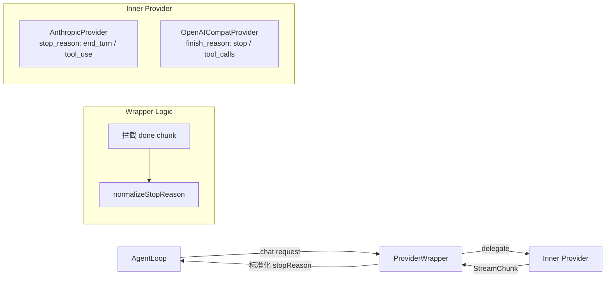

# ProviderWrapper 与 AgentLoop 事件模型重构

> 日期: 2026-03-18
> 状态: 已完成
> 关联: `20260315140000_AgentLoop事件模型重构规划.md`、`20260317210000_AgentLoop事件模型重构设计文档.md`

---

## 一、背景

### 1.1 触发原因

Web UI 开发中发现两个架构级问题：

1. **LLM 调用没有明确的"结束"事件** — `llm_usage` 名字暗示"统计数据"，实际充当了"调用结束"信号，消费者困惑
2. **stopReason 硬编码** — AgentLoop 写死了 `'end_turn'`，不管 Provider 实际返回什么。Anthropic 的 `tool_use`、OpenAI 的 `tool_calls`、`length` 等值全部丢失

### 1.2 深层问题

Provider 层返回的有价值信息（stop_reason / finish_reason）在传递过程中丢失了：

```
Anthropic SDK → stop_reason: "tool_use"     ┐
                                              ├→ Provider → StreamChunk(done) → 丢了！
OpenAI SDK   → finish_reason: "tool_calls"  ┘

AgentLoop → yield { type: 'llm_usage', stopReason: 'end_turn' }  ← 硬编码
```

---

## 二、ProviderWrapper 代理层

### 2.1 设计理念

**不改底层 Provider，在调用层加一个统一拦截代理。** 所有横切关注点在 Wrapper 里处理，底层 Provider 保持纯净。

```
createProvider(name, config)
  → AnthropicProvider / OpenAICompatProvider  ← 纯 LLM 调用，不混横切逻辑
    → ProviderWrapper(inner)                  ← 统一拦截层
      → AgentLoop 消费
```

### 2.2 架构图



### 2.3 代码位置

```
src/providers/
├── provider.ts         ← LLMProvider 接口定义（不变）
├── wrapper.ts          ← 新增：ProviderWrapper + normalizeStopReason
├── registry.ts         ← 改造：返回 Wrapper(inner)
├── anthropic.ts        ← 微改：done chunk 带 finalMsg.stop_reason
└── openai-compat.ts    ← 微改：done chunk 带 finish_reason
```

### 2.4 stopReason 标准化映射

Provider 保留原始值，Wrapper 做统一标准化：

| 原始值 (Anthropic) | 原始值 (OpenAI) | 标准化后 | 含义 |
|-------------------|----------------|---------|------|
| `end_turn` | `stop` | `end_turn` | 自然结束 |
| `tool_use` | `tool_calls` | `tool_use` | 需要调工具 |
| `max_tokens` | `length` | `max_tokens` | 输出截断 |
| `stop_sequence` | — | `stop_sequence` | 命中停止序列 |
| — | `content_filter` | `content_filter` | 内容过滤 |

标准化统一为 Anthropic 命名体系（cCli 的 JSONL 日志已有 `end_turn` 的历史数据）。

### 2.5 未来扩展路线

Wrapper 是所有 Provider 的出口，未来加任何横切逻辑都在这里：

```
当前:     stopReason 标准化
Phase 2:  429 限流自动重试（拦截 error chunk，判断 429/503，等待后重试）
Phase 3:  模型降级池（主 Provider 失败 → 自动切备选 Provider）
Phase 4:  Token 预算控制（拦截 usage chunk，累计判断是否超预算）
Phase 5:  响应缓存（相同 messages hash → 直接返回缓存）
```

**每次扩展只改 Wrapper 一处，不碰底层 Provider。**

---

## 三、AgentLoop 事件模型重构

### 3.1 事件改名

```diff
- | { type: 'llm_usage'; inputTokens; outputTokens; cacheReadTokens; cacheWriteTokens; stopReason }
+ | { type: 'llm_done';  inputTokens; outputTokens; cacheReadTokens; cacheWriteTokens; stopReason }
```

改名理由：`llm_usage` 的名字只暗示"token 统计"，但它实际承担了"LLM 调用结束"的信号职责。改为 `llm_done` 后：
- 与 `tool_done` 命名对称
- 消费者一看就知道"LLM 调用结束了"
- token 统计作为附带数据（就像 `tool_done` 附带 `durationMs`）

### 3.2 done 事件加 reason

```diff
- | { type: 'done' }
+ | { type: 'done'; reason?: 'complete' | 'max_turns' | 'aborted' }
```

| reason | 含义 | 原来的处理 |
|--------|------|-----------|
| `complete` | 正常完成（LLM 没有 tool_calls） | `yield { type: 'done' }` |
| `max_turns` | 达到最大轮次限制 | `yield { type: 'error', error: '超过最大轮次' }` ← 不是 error |
| `aborted` | 用户中止 | 在 useChat 里处理（AbortError） |

`max_turns` 从 error 改为 done + reason，因为达到轮次限制不是"错误"，是正常的执行边界。

### 3.3 事件生命周期对称性

```
重构前:
  LLM:   llm_start → text* → llm_usage (名字不对, stopReason 硬编码)
  Tool:  tool_start → tool_done
  Agent: done (无 reason)

重构后:
  LLM:   llm_start → text* → llm_done (对称命名, stopReason 从 Provider 透传)
  Tool:  tool_start → tool_done
  Agent: done (reason: complete / max_turns / aborted)
```

### 3.4 完整的事件流示例

```
用户提问 "帮我写个函数":

  llm_start { provider: 'glm', model: 'glm-5', messageCount: 3 }
  text { text: '好的，' }
  text { text: '我来帮你写...' }
  llm_done { inputTokens: 5974, outputTokens: 580, stopReason: 'end_turn' }
  done { reason: 'complete' }

用户提问 "帮我读取并修改这个文件":

  llm_start { provider: 'glm', model: 'glm-5', messageCount: 5 }
  text { text: '好的，我先读取文件...' }
  llm_done { inputTokens: 8000, outputTokens: 200, stopReason: 'tool_use' }  ← 不再硬编码！
  tool_start { toolName: 'read_file', ... }
  tool_done { toolName: 'read_file', success: true, ... }
  llm_start { provider: 'glm', model: 'glm-5', messageCount: 7 }
  text { text: '文件内容如下，我来修改...' }
  llm_done { inputTokens: 12000, outputTokens: 400, stopReason: 'end_turn' }
  done { reason: 'complete' }
```

---

## 四、数据透传链路

### 4.1 完整链路

```
Anthropic SDK
  finalMessage().stop_reason = "tool_use"
    ↓
AnthropicProvider
  yield { type: 'done', stopReason: 'tool_use' }  ← 原始值
    ↓
ProviderWrapper
  normalizeStopReason('tool_use') → 'tool_use'    ← 标准化（Anthropic 不变）
    ↓
AgentLoop.#callLLM
  chunk.stopReason = 'tool_use'
  yield { type: 'llm_done', ..., stopReason: 'tool_use' }
    ↓
SessionLogger
  case 'llm_done' → appendEvent('llm_call_end', { stopReason: 'tool_use' })
    ↓
JSONL 文件
  { "type": "llm_call_end", "stopReason": "tool_use", ... }
```

```
OpenAI / GLM SDK (via LangChain)
  response_metadata.finish_reason = "stop"
    ↓
OpenAICompatProvider
  yield { type: 'done', stopReason: 'stop' }      ← 原始值
    ↓
ProviderWrapper
  normalizeStopReason('stop') → 'end_turn'         ← 标准化（OpenAI → Anthropic 命名）
    ↓
AgentLoop.#callLLM
  chunk.stopReason = 'end_turn'
  yield { type: 'llm_done', ..., stopReason: 'end_turn' }
    ↓
JSONL 文件
  { "type": "llm_call_end", "stopReason": "end_turn", ... }
```

### 4.2 JSONL 日志验证

实际运行后的 JSONL 日志（GLM-5 模型）：

```json
{ "type": "llm_call_start", "provider": "glm", "model": "glm-5", "messageCount": 1 }
{ "type": "llm_call_end", "inputTokens": 5974, "outputTokens": 580, "stopReason": "end_turn" }
```

`stopReason` 从 GLM 的 `finish_reason: "stop"` 经过 Wrapper 标准化为 `"end_turn"`，完整透传到 JSONL。

---

## 五、改动清单

### 5.1 新增文件

| 文件 | 职责 |
|------|------|
| `src/providers/wrapper.ts` | ProviderWrapper 代理类 + normalizeStopReason 映射函数 |

### 5.2 修改文件

| 文件 | 改动 |
|------|------|
| `src/core/types.ts` | StreamChunk 加 `stopReason?: string` |
| `src/core/agent-loop.ts` | `llm_usage` → `llm_done`；从 chunk 取 stopReason；done 加 reason |
| `src/providers/anthropic.ts` | done chunk 带 `finalMsg.stop_reason` |
| `src/providers/openai-compat.ts` | done chunk 带 `finish_reason`（fallback 链） |
| `src/providers/registry.ts` | `createProvider` 返回 `ProviderWrapper(inner)` |
| `src/observability/session-logger.ts` | `case 'llm_usage'` → `case 'llm_done'` |
| `src/observability/token-meter.ts` | 事件类型判断更新 |
| `src/tools/dispatch-agent.ts` | 子 Agent 的事件类型更新 |
| `web/src/types.ts` | `llm_usage` → `llm_done` + `stopReason` |
| 4 个测试文件 | 事件类型更新 |

### 5.3 向后兼容

| 层面 | 影响 |
|------|------|
| JSONL 日志 | `llm_call_end` 类型名不变（SessionLogger 的映射逻辑不变），已有日志完全兼容 |
| SQLite | 表结构不变，只是写入时的事件类型判断改了 |
| Web 前端 | ServerEvent 类型同步更新，`llm_usage` → `llm_done` |
| Bridge 协议 | 事件透传不过滤 `llm_done`，无需改动 |

---

## 六、LangChain finish_reason 获取的坑

### 6.1 问题

LangChain 的 `ChatOpenAI` 在流式模式下，`finish_reason` 的位置不统一（[Issue #33717](https://github.com/langchain-ai/langchain/issues/33717)）：

- 非流式：`response_metadata.finish_reason` ✅
- 流式聚合后：位置不稳定，可能在 `response_metadata`、`additional_kwargs`、或都没有

### 6.2 应对：Fallback 链

```typescript
const finishReason = (final as any).response_metadata?.finish_reason
  ?? (final as any).additional_kwargs?.finish_reason
  ?? (final.tool_calls?.length > 0 ? 'tool_calls' : 'stop')  // 推断
```

三层 fallback：
1. 优先 `response_metadata.finish_reason`
2. 备选 `additional_kwargs.finish_reason`
3. 兜底推断：有 tool_calls → `'tool_calls'`，否则 → `'stop'`

---

## 七、经验总结

### 7.1 代理模式（Proxy/Wrapper）是处理横切关注点的最佳模式

**横切关注点**（cross-cutting concern）是那些"每个模块都需要但跟核心逻辑无关"的事情——日志、限流、重试、监控。如果直接写在每个模块里，代码会散落各处、难以维护。

Wrapper 模式的价值：**一处修改，全局生效。** 未来加限流、重试、降级，只改 Wrapper 一个文件。

### 7.2 事件命名要体现"角色"而非"数据"

`llm_usage` → `llm_done` 的改名看起来很小，但影响深远。消费者看到 `llm_usage` 会犹豫"这是统计数据还是结束信号？"，看到 `llm_done` 就很清楚。

**命名原则**：事件类型名应该回答"发生了什么"（done），而不是"带了什么数据"（usage）。

### 7.3 不要硬编码可以从上游拿到的值

`stopReason: 'end_turn'` 这个硬编码存在了很久没被发现，因为绝大多数情况下 LLM 确实返回 `end_turn`。但当 LLM 返回 `tool_use`（需要调工具）或 `max_tokens`（输出截断）时，日志里记的是错的。

**原则**：如果上游有这个数据，就透传下来，不要自己猜。
